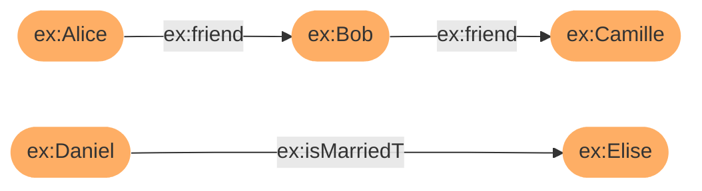

# Getting Started With Corese-library

This tutorial show how to use the Corese-library framework through simple examples of the main features.
We assume a basic knowledge in Java programming and in semantic web.

The first part describes how to create, load and export a Graph.
The second part show how to query a graph with [SPARQL](https://www.w3.org/TR/sparql11-query/).
The third part details how to validate a graph with the [Shapes Constraint Language (SHACL)](https://www.w3.org/TR/shacl/).
The fourth part shows how to transforme a graph with the extension language [SPARQL Template Transformation Language (STTL)](https://files.inria.fr/corese/doc/sttl.html).
The fifth part details how to apply a set of rules on a graph using the [SPARQL Rule](https://files.inria.fr/corese/doc/rule.html) extension language.
Finally, the sixth part describes how to define and use functions with the [LDScript](https://files.inria.fr/corese/doc/ldscript.html) extension language.

1. [Getting Started With Corese-library](#getting-started-with-corese-library)
   1. [1. Installation](#1-installation)
   2. [2. Graph](#2-graph)
      1. [2.1. Build a Graph by program](#21-build-a-graph-by-program)
      2. [2.2. Load Graph from file](#22-load-graph-from-file)
      3. [2.3. Export Graph to file](#23-export-graph-to-file)
   3. [3. SPARQL Protocol and RDF Query Language](#3-sparql-protocol-and-rdf-query-language)
      1. [3.1. SPARQL Select query](#31-sparql-select-query)
      2. [3.2. SPARQL Ask query](#32-sparql-ask-query)
      3. [3.3. SPARQL Construct query](#33-sparql-construct-query)
      4. [3.4. SPARQL Update query](#34-sparql-update-query)
   4. [4. Shapes Constraint Language (SHACL)](#4-shapes-constraint-language-shacl)
   5. [5. SPARQL Template Transformation Language (STTL)](#5-sparql-template-transformation-language-sttl)
      1. [5.1. Transform a graph in a visual HTML format](#51-transform-a-graph-in-a-visual-html-format)
   6. [6. SPARQL Rule](#6-sparql-rule)
      1. [6.1. Load rules from a file](#61-load-rules-from-a-file)
      2. [6.2. OWL Rules](#62-owl-rules)
   7. [7. LDScript](#7-ldscript)
      1. [7.1. Fibonacci function call from Java](#71-fibonacci-function-call-from-java)
      2. [7.2. LDScript in SPARQL](#72-ldscript-in-sparql)
      3. [7.3. Advanced example](#73-advanced-example)

## 1. Installation

Installations instructions are available on the [Corese-Command GitHub repository](https://github.com/Wimmics/corese).

## 2. Graph

This section describes how to create a graph manually, load a graph from file and serialize a graph to file.

### 2.1. Build a Graph by program

> It is also possible to use the [RDF4J Model API](https://notes.inria.fr/s/OB038LBLV#11-build-a-corese-model-manually) to create and manipulate a graph.

The example shows how to create the RDF graph bellow:


This graph represents three statements :

- Edith Piaf is a singer
- Edith Piaf's first name is Edith
- Edith Piaf's last name is Piaf

```java
// Define the namespace ex
String ex = "http://example.org/";

// Create a new empty Graph
Graph graph = Graph.create();

// Create and add IRIs to Graph
Node edithPiafIRI = graph.addResource(ex + "EdithPiaf");
Node singerIRI = graph.addResource(ex + "Singer");

// Create and add properties to Graph
Node rdfTypeProperty = graph.addProperty(RDF.TYPE);
Node firstNameProperty = graph.addProperty(ex + "firstName");
Node lastNameProperty = graph.addProperty(ex + "lastName");

// Create and add datatypes to Graph
Node edithDatatype = graph.addLiteral("Edith");
Node piafDatatype = graph.addLiteral("Piaf");

// Add first statement : Edith Piaf is an Singer
graph.addEdge(edithPiafIRI, rdfTypeProperty, singerIRI);
// Add second statement : Edith Piaf's first name is Edith
graph.addEdge(edithPiafIRI, firstNameProperty, edithDatatype);
// Add third statement : Edith Piaf's last name is Piaf
graph.addEdge(edithPiafIRI, lastNameProperty, piafDatatype);
```

### 2.2. Load Graph from file

This example shows how to load a graph from a file.
Corese Loader can load formats :

- RDF/XML (.rdf)
- TURTLE (.ttl)
- TRIG (.trig)
- JSONLD (.jsonld)
- NTRIPLES (.nt)
- NQUADS (.nq)
- JSON-LD (.jsonld)
- RDFa (.html)

```java
// Create a new empty Graph
Graph graph = Graph.create();

// Create loader and parse file
Load ld = Load.create(graph);
ld.parse("input graph file path");
```

### 2.3. Export Graph to file

This example shows how to serialize a graph in file, here in TURTLE format.

```java
// We assume that the 'graph' variable has been define previously

// Create exporter
ResultFormat exporter = ResultFormat.create(graph, ResultFormat.TURTLE_FORMAT);
String result = exporter.toString();

// Write result in file
FileWriter writer = new FileWriter("output file path");
writer.write(result);
writer.close();
```

Corese Transformer can serialize graphs in different formats :

- RDF/XML `ResultFormat.RDF_XML_FORMAT`
- TURTLE `ResultFormat.TURTLE_FORMAT`
- TRIG `ResultFormat.TRIG_FORMAT`
- JSONLD `ResultFormat.JSONLD_FORMAT`
- NTRIPLES `ResultFormat.NTRIPLES_FORMAT`
- NQUADS `ResultFormat.NQUADS_FORMAT`

## 3. SPARQL Protocol and RDF Query Language

This section describes how to query a graph with [SPARQL](https://www.w3.org/TR/sparql11-query/) in Corese.

### 3.1. SPARQL Select query

This example shows how to execute a SPARQL SELECT query, print and export results.

```java
// We assume that the 'graph' variable has been define previously

// Sparql query
QueryProcess exec = QueryProcess.create(graph);
Mappings map = exec.query("select * where { ?s ?p ?o }");
```

Example of how to get a variable value in the results:

```java
// Iterate on each result
for (Mapping m : map) {
    // Get the value of the variable ?o
    IDatatype dt = m.getValue("?o");

    // Test and convert the value to java type
    if (dt.isURI()) {
        String uriLabel = dt.getLabel();
    }
    else if (dt.isBlank()) {
        String BNLabel = dt.getLabel();
    }
    else {
        if (dt.isBoolean()) {
            boolean boolResult = dt.booleanValue();
        }
        else if (dt.isNumber()) {
            int intResult = dt.intValue();
            double doubleResult = dt.doubleValue();
            float floatResult = dt.floatValue();
            BigDecimal bigDecimalResult = dt.decimalValue();
            long longResult = dt.longValue();
        }
        else {
            String stringResult = dt.stringValue();
            String stringLangResult = dt.getLang();
        }
    }
}
```

Print list of variables in the result:

```java
System.out.println(map.getSelect());
// Exemple: ["?s", "?p", "?o"]
```

Print results:

```java
for (Mapping m: map){
    System.out.println(m);
}
```

Export result in XML:

```java
ResultFormat result_xml = ResultFormat.create(map);
result_xml.write("output file path");
```

### 3.2. SPARQL Ask query

This example shows how to execute a SPARQL ASK query and print results.

```java
// We assume that the 'graph' variable has been define previously

// Sparql query
QueryProcess exec = QueryProcess.create(graph);
Mappings map = exec.query("ask { ?person foaf:name ?name. }");
```

Print results:

```java
// if the mappings is empty then the result is false
// if the mappings is not empty then the result is true
system.out.println(!map.isEmpty());
```

### 3.3. SPARQL Construct query

```java
// We assume that the 'graph' variable has been define previously

// Sparql query
QueryProcess exec = QueryProcess.create(graph);
Mappings map = exec.query("""
    prefix foaf: <http://xmlns.com/foaf/0.1/>
    prefix vcard: <http://www.w3.org/2001/vcard-rdf/3.0#>

    construct {
        ?person vcard:FN ?name
    }
    where {
        ?person foaf:name ?name.
    }
    """
);
```

Print graph result of a construct-where query :

```java
Graph g = (Graph) map.getGraph();
Graph result_graph = (Graph) map.getGraph();
System.out.println(result_graph.display());
```

Export result in XML:

```java
// Export result in XML
ResultFormat result_xml = ResultFormat.create(map);
result_xml.write("output file path");
```

### 3.4. SPARQL Update query

```java
// We assume that the 'graph' variable has been define previously

// Sparql query
QueryProcess exec = QueryProcess.create(graph);
exec.query("""
    prefix foaf: <http://xmlns.com/foaf/0.1/>
    prefix vcard: <http://www.w3.org/2001/vcard-rdf/3.0#>

    insert {
        ?person vcard:FN ?name
    }
    where {
        ?person foaf:name ?name.
    }
    """
);
```

## 4. Shapes Constraint Language (SHACL)

This section show how to validate a graph with the [Shapes Constraint Language (SHACL) in _Corese_](https://www.w3.org/TR/shacl/).
The example below shows us how to load a shapes graph (SHACL file), check the validity of the data graph and finally print results.

```java
// Load data graph
Graph dataGraph = Graph.create();
Load ld = Load.create(dataGraph);
ld.parse("input graph file path");

// Load shape graph
Graph shapeGraph = Graph.create();
ld = Load.create(shapeGraph);
ld.parse("input shape file path.ttl");

// Evaluation
Shacl shacl = new Shacl(dataGraph, shapeGraph);
Graph result = shacl.eval();

// print results
Transformer transformer = Transformer.create(result, Transformer.TURTLE);
System.out.println(transformer.toString());
```

**Input graph file path:**

```turtle
@prefix ex: <http://example.org/ns#> .
@prefix rdf: <http://www.w3.org/1999/02/22-rdf-syntax-ns#> .

ex:Alice ex:ssn "987-65-4323" ;
    ex:worksFor ex:Haribo, ex:KitKat ;
    rdf:type ex:Person .

ex:Bob ex:ssn "124-35-6789" ;
    ex:worksFor ex:Twitch ;
    rdf:type ex:Person .

ex:Calvin ex:ssn "648-67-6545" ;
    ex:worksFor ex:UntypedCompany ;
    rdf:type ex:Person .

ex:Haribo rdf:type ex:Company .

ex:KitKat rdf:type ex:Company .

ex:Twitch rdf:type ex:Company .

ex:UntypedCompany rdf:type ex:Company .
```

**Input shape file path:**

```turtle
@prefix sh: <http://www.w3.org/ns/shacl#> .
@prefix xsd: <http://www.w3.org/2001/XMLSchema#> .
@prefix ex: <http://example.org/ns#> .
@prefix rdf: <http://www.w3.org/1999/02/22-rdf-syntax-ns#> .

ex:PersonShape
    a sh:NodeShape ;
    sh:targetClass ex:Person ;
    sh:property [
        sh:path ex:ssn ;
        sh:maxCount 1 ;
        sh:datatype xsd:string ;
        sh:pattern "^\\d{3}-\\d{2}-\\d{4}$" ;
    ] ;
    sh:property [
        sh:path ex:worksFor ;
        sh:class ex:Company ;
        sh:nodeKind sh:IRI ;
    ] ;
    sh:closed true ;
    sh:ignoredProperties ( rdf:type ) .
```

**Result:**

```turtle
@prefix xsh: <http://www.w3.org/ns/shacl#> .
@prefix sh: <http://www.w3.org/ns/shacl#> .

[a sh:ValidationReport ;
    sh:conforms true] .
```

## 5. SPARQL Template Transformation Language (STTL)

This sections shows how to transforme a graph with a subset of the extension language [SPARQL Template Transformation Language (STTL)](https://files.inria.fr/corese/doc/sttl.html).

### 5.1. Transform a graph in a visual HTML format

This example detail how load a data graph from a file, transforme it in a visual HTML format and export the result in a file.

```java
// Open template file
Path path = Path.of("input template file path");
String sttl_query = Files.readString(path, StandardCharsets.UTF_8);

// Load data graph
Graph dataGraph = Graph.create();
Load ld = Load.create(dataGraph);
ld.parse("input graph file path");

// Apply STTL query
QueryProcess exec = QueryProcess.create(dataGraph);
Mappings map = exec.query(sttl_query);

// Export result
ResultFormat result_xml = ResultFormat.create(map);
result_xml.write("output file path");
```

**Input template file:**

```rq
template {
    format {
        "<html>\n\n<body>\n\t<table>\n%s\t</table>\n</body>\n\n</html>"
        group {
            format {
                "\t\t<tr>\n\t\t\t<td>%s</td>\n\t\t\t<td>%s</td>\n\t\t\t<td>%s</td>\n\t\t</tr>\n"
                ?s ?p ?o
            }
        }
    }
}
where {
    ?s ?p ?o
}
order by ?s ?p ?o
```

**Result :**

```html
<html>

<body>
    <table>
        <tr>
            <td>http://example.org/EdithPiaf</td>
            <td>http://example.org/firstName</td>
            <td>Edith</td>
        </tr>
        <tr>
            <td>http://example.org/EdithPiaf</td>
            <td>http://example.org/lastName</td>
            <td>Piaf</td>
        </tr>
        <tr>
            <td>http://example.org/EdithPiaf</td>
            <td>http://www.w3.org/1999/02/22-rdf-syntax-ns#type</td>
            <td>http://example.org/Singer</td>
        </tr>
    </table>
</body>

</html>
```

| ?s                             | ?p                                                | ?o                          |
| ------------------------------ | ------------------------------------------------- | --------------------------- |
| <http://example.org/EdithPiaf> | <http://example.org/firstName>                    | Edith                       |
| <http://example.org/EdithPiaf> | <http://example.org/lastName>                     | Piaf                        |
| <http://example.org/EdithPiaf> | <http://www.w3.org/1999/02/22-rdf-syntax-ns#type> | <http://example.org/Singer> |

## 6. SPARQL Rule

This section details how to apply a set of rules on a graph using the [SPARQL Rule extension language](https://files.inria.fr/corese/doc/rule.html).

### 6.1. Load rules from a file

The example below shows the application of two rules (symmetry and transitivity) on a simple graph.

```java
// Create and load data in a graph
Graph dataGraph = Graph.create();
Load dataLoader = Load.create(dataGraph);
dataLoader.parse("input graph file path");


// Create and load rules into a rules engine
RuleEngine ruleEngine = RuleEngine.create(dataGraph);
RuleLoad ruleLoader = RuleLoad.create(ruleEngine);
ruleLoader.parse("input rules file path.rul");


// Apply rules on graph
ruleEngine.process();
```

**Original graph:**



**Rules file:**

- Symmetry : `if exist X➝Y then Y➝X`
- Transitivity : `if X➝Y➝Z then X➝Z`

```xml
<?xml version="1.0"?>

<rdf:RDF
    xmlns:rdf="http://www.w3.org/1999/02/22-rdf-syntax-ns#"
    xmlns="http://ns.inria.fr/corese/rule/">

    <rule>
        <body>
            <![CDATA[
                prefix owl: <http://www.w3.org/2002/07/owl#>
                construct {
                    ?x ?p ?z
                }
                where {
                    ?p a owl:TransitiveProperty .
                    ?x ?p ?y .
                    ?y ?p ?z
                }
            ]]>
        </body>
    </rule>

    <rule>
        <body>
            <![CDATA[
                prefix owl: <http://www.w3.org/2002/07/owl#>
                construct {
                   ?y ?p ?x
                }
                where {
                    ?p a owl:SymmetricProperty .
                    ?x ?p ?y .
                }
            ]]>
        </body>
    </rule>

</rdf:RDF>

```

**Result graph:**

```mermaid
graph LR;
    classDef IRI fill:#FEAE65,stroke-width:0px

    iri:alice(["ex:Alice"])
    iri:bob(["ex:Bob"])
    iri:camille(["ex:Camille"])
    iri:daniel(["ex:Daniel"])
    iri:elise(["ex:Elise"])

    class iri:alice,iri:bob,iri:camille,iri:daniel,iri:elise IRI

    iri:alice--ex:friend-->iri:bob;
    iri:bob--ex:friend-->iri:camille;
    iri:alice-.ex:friend.->iri:camille;
    iri:daniel--ex:isMarriedTo.->iri:elise;
    iri:elise-.ex:isMarriedTo.->iri:daniel;

    linkStyle 4,2 stroke:#a3ddcb,stroke-width:3px;
```

### 6.2. OWL Rules

The example below shows the application of OWL RL rules.

```java
// We assume that the 'graph' variable has been define previously

// Apply rules
RuleEngine engine = RuleEngine.create(graph);
engine.setProfile(RuleEngine.OWL_RL);
engine.process();
```

## 7. LDScript

This section describes how to define and use functions with the [LDScript extension language](https://files.inria.fr/corese/doc/ldscript.html).

### 7.1. Fibonacci function call from Java

This example shows how to define and compute the twelfth number of the Fibonnacci sequence.

```java
// Open LDScript file
Path path = Path.of("input LDScript file path.rq");
String ldScript = Files.readString(path, StandardCharsets.UTF_8);

// Compile LDScript
QueryProcess exec = QueryProcess.create();
exec.compile(ldScript);

// Compute the twelfth number of the Fibonnacci sequence
String name = "http://ns.inria.fr/fibonacci";
IDatatype dt = exec.funcall(name, DatatypeMap.newInstance(25));

// Print result
System.out.println(dt);
```

**Input LDScript file path:**

```rq
prefix fun: <http://ns.inria.fr/>

@public function fun:fibonacci(n) {
    if (n < 0) {
        error()
    }
    else if (n = 0) {
        return(0)
    }
    else if (n = 1) {
        return(1)
    }
    else {
        return (fun:fibonacci(n - 1) + fun:fibonacci(n - 2))
    }
}
```

### 7.2. LDScript in SPARQL

This example shows how to call an LDScript function from a SPARQL query.

```java
String check_query = """
prefix ex: <http://example.com/city/>
prefix rdf: <http://www.w3.org/1999/02/22-rdf-syntax-ns#>
prefix fun: <http://ns.inria.fr/>

select ?name ?area
where {
    ?city rdf:type ex:city ;
            ex:area ?area .
    filter(?area > fun:toSquareKm(40))
}

# Convert square mile to square Kilometer
function fun:toSquareKm(squareMile) {
    return (squareMile * 2.59)
}
""";


// Load graph
Graph graph = Graph.create();
Load ld = Load.create(graph);
ld.parse("input file path");

// Sparql query
QueryProcess exec = QueryProcess.create(graph);
Mappings map = exec.query(check_query);
```

### 7.3. Advanced example

The java program below computes the percentage of people subscribed to social networks of city compared to its number of inhabitants.
Data is collected from Wikidata.

```java
// Open LDScript file
Path path = Path.of("input LDScript file path.rq");
String ldScript = Files.readString(path, StandardCharsets.UTF_8);

// Compile LDScript
QueryProcess exec = QueryProcess.create();
exec.compile(ldScript);

// Execute program
String name = "http://ns.inria.fr/main";
IDatatype dt = exec.funcall(name);

// Print result
System.out.println(dt);
```

**Input LDScript file path:**

```rq
prefix fun: <http://ns.inria.fr/>

prefix wd: <http://www.wikidata.org/entity/>
prefix wdt: <http://www.wikidata.org/prop/direct/>
prefix wikibase: <http://wikiba.se/ontology#>
prefix bd: <http://www.bigdata.com/rdf#>
prefix rdfs: <http://www.w3.org/2000/01/rdf-schema#>


@public
function fun:percentage(sub, total) {
    return (sub / total * 100)
}

@public
function fun:citypopulationsocialmedia() {

    query(
        select ?city ?citylabel ?population ?socialmediafolower where {
            service <https://query.wikidata.org/sparql> {
                ?city wdt:P31 wd:Q1549591;
                wdt:P8687 ?socialmediafolower;
                wdt:P1082 ?population.
                optional {
                    ?city rdfs:label ?citylabel
                    filter (lang(?citylabel) = "en").
                }
            }
        }
        order by desc (?socialmediafolower)
        limit 100
    )
}

@public
function fun:main() {
    xt:sort(
        maplist (
            function(x) {
                let ((citylabel population socialmediafolower) = x) {
                    return (xt:list(citylabel, fun:percentage(socialmediafolower, population)))
                }
            },
            fun:citypopulationsocialmedia()
        ),
        function(x,y)  {
            let ((x_name, x_value) = x, (y_name, y_value) = y) {
                if (x_value < y_value, 1, if(x=y, o, -1))
            }
        }
    )
}
```
