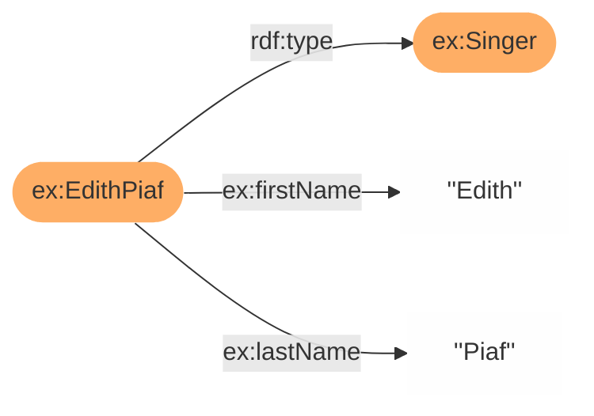

# Corese-library and RDF4J

[RDF4J](https://rdf4j.org/about/) is a project of the Eclipse Foundation. It's an open source modular Java framework for working with RDF data. RDF4J offers an easy-to-use API that can be connected to all leading RDF database solutions.

This document details the RDF4J APIs implemented in Corese and how to use and connect the Corese framework with RDF4J.

1. [Corese-library and RDF4J](#corese-library-and-rdf4j)
   1. [1. Implementation of the RDF4J model API in Corese](#1-implementation-of-the-rdf4j-model-api-in-corese)
      1. [1.1. Build a Corese Model by program](#11-build-a-corese-model-by-program)
      2. [1.2. Manipulate a Corese Model](#12-manipulate-a-corese-model)
      3. [1.3. Get a Corese Model from a Corese Graph](#13-get-a-corese-model-from-a-corese-graph)
      4. [1.4. Get a Corese Graph from a Corese Model](#14-get-a-corese-graph-from-a-corese-model)
      5. [1.5. Get a Corese model from any object that implements the RDF4J model API](#15-get-a-corese-model-from-any-object-that-implements-the-rdf4j-model-api)
      6. [1.6. Use external tools compatible with the RDF4J model API](#16-use-external-tools-compatible-with-the-rdf4j-model-api)
         1. [1.6.1. RIO](#161-rio)
         2. [1.6.2. RDF4J SPARQL Engine with a Corese model](#162-rdf4j-sparql-engine-with-a-corese-model)
   2. [2. Implementation of an RDF4J data manager in Corese](#2-implementation-of-an-rdf4j-data-manager-in-corese)

## 1. Implementation of the RDF4J model API in Corese

[RDF4J model API](https://rdf4j.org/documentation/programming/model/) provides the basic building blocks for manipulating RDF data.
Corese implements this API in the `CoreseModel` class.

Thus, in Corese a graph can be constructed, explored and manipulated through two APi:

- the corese graph API (Described [in this document](https://notes.inria.fr/s/hiiedLfVe#11-build-a-graph-manually))
- the RDF4J model API (Described here)

This section presents examples of how to use the Corese implementation of the RDF4J model API.

### 1.1. Build a Corese Model by program

The example shows how to create the RDF graph below with the Corese implementation of the RDF4J model API:



This model represents three statements :

- Edith Piaf is a singer
- Edith Piaf's first name is Edith
- Edith Piaf's last name is Piaf

```java
// Define the namespace ex
String ex = "http://example.org/";

// Create a new empty CoreseModel
Model corese_model = new CoreseModel();

// Create IRIs
IRI edithPiafIRI = Values.iri(ex, "EdithPiaf");
IRI singerIRI = Values.iri(ex, "Singer");

// Create properties
IRI rdfTypeProperty = Values.iri(RDF.TYPE.stringValue());
IRI firstNameProperty = Values.iri(ex, "firstName");
IRI lastNameProperty = Values.iri(ex, "lastName");

// Create datatypes
Literal edithDatatype = Values.literal("Edith");
Literal piafDatatype = Values.literal("Piaf");

// Add first statement : Edith Piaf is an Singer
corese_model.add(edithPiafIRI, rdfTypeProperty, singerIRI);
// Add second statement : Edith Piaf's first name is Edith
corese_model.add(edithPiafIRI, firstNameProperty, edithDatatype);
// Add third statement : Edith Piaf's last name is Piaf
corese_model.add(edithPiafIRI, lastNameProperty, piafDatatype);
```

### 1.2. Manipulate a Corese Model

`CoreseModel` implements all methods defined in the RDF4J model API. There are many methods to modify and explore the graph.
All available methods and their documentation are described [here](https://rdf4j.org/javadoc/latest/org/eclipse/rdf4j/model/Model.html).

### 1.3. Get a Corese Model from a Corese Graph

This exemple shows how to convert a Corese Graph to an equivalent Corese Model.

```java
Graph corese_graph = new Graph();

// Operations on the corese graph (e.g: add edge, etc)
// […]

// Convert the Corese Graph to Corese Model
Model RDF4J_corese_model = new CoreseModel(corese_graph);
```

### 1.4. Get a Corese Graph from a Corese Model

This exemple shows how to convert a Corese Model to an equivalent Corese Graph.

```java
Model RDF4J_corese_model = new CoreseModel();

// Operations on the Corese Model (e.g: add statement, etc)
// […]

// Convert the Corese Model to Corese Graph
Graph corese_graph = RDF4J_corese_model.getCoreseGraph();
```

### 1.5. Get a Corese model from any object that implements the RDF4J model API

This exemple shows how to convert any object that implements the RDF4J model API to an equivalent Corese Model.

This first example is with a TreeModel, an implementation of the Model API directly available in the RDF4J library.

```java
Model RDF4J_tree_model = new TreeModel();

// Operations on the RDF4J tree model (e.g: add statement, etc)
// […]

// Convert the RDF4J tree model to an Corese Model
Model RDF4J_corese_model = new CoreseModel(RDF4J_tree_model);
```

This second example is with an another CoreseModel.

```java
Model original_RDF4J_corese_model = new CoreseModel();

// Operations on the Corese model (e.g: add statement, etc)
// […]

// Duplicate the Corese model to an another Corese Model
Model another_RDF4J_corese_model = new CoreseModel(original_RDF4J_corese_model);
```

### 1.6. Use external tools compatible with the RDF4J model API

#### 1.6.1. RIO

Rio is a set of parsers and writers for RDF developed for RDF4J framework. It can be use to parse from or write to an RDF document.
You can find the RIO documentation [here](https://rdf4j.org/javadoc/3.4.3/org/eclipse/rdf4j/rio/Rio.html).

This example shows how to parse an RDF document with RIO, load data into a Corese model and serialize the contents of the Corese model into a file.

```java
CoreseModel model = new CoreseModel();

// Parse from file
RDFParser rdfParser = Rio.createParser(RDFFormat.TURTLE);
rdfParser.setRDFHandler(new StatementCollector(model));

InputStream input_stream = Rdf4jExperimentations.class.getResourceAsStream(
        "http://example.org/example.ttl");

try {
    rdfParser.parse(input_stream);
} catch (IOException e) {
    // handle IO problems (e.g. the file could not be read)
} catch (RDFParseException e) {
    // handle unrecoverable parse error
} catch (RDFHandlerException e) {
    // handle a problem encountered by the RDFHandler
} finally {
    try {
        input_stream.close();
    } catch (IOException e) {
        e.printStackTrace();
    }
}

// Serialization to a file
FileOutputStream out = new FileOutputStream("example_result.ttl");
try {
    Rio.write(model, out, RDFFormat.TURTLE);
} finally {
    out.close();
}
```

#### 1.6.2. RDF4J SPARQL Engine with a Corese model

The RDF4J Framework also implements a SPARQL engine. This example shows how to use the RDF4J SPARQL engine with a Corese model.

```java
// Create a Corese model
CoreseModel model = new CoreseModel();

// Load file content in Corese model
// […]

// Create a new Repository. Here, we choose a database implementation
// that simply stores everything in main memory.
Repository db = new SailRepository(new MemoryStore());

// Open a connection to the database
try (RepositoryConnection conn = db.getConnection()) {

    // add the model
    conn.add(model);

    // We do a simple SPARQL SELECT-query
    String queryString = "PREFIX ex: <http://example.org/ns#> \n";
    queryString += "PREFIX rf: <" + RDF.NAMESPACE + "> \n";
    queryString += "SELECT ?s ?o \n";
    queryString += "WHERE { \n";
    queryString += "    ?s a ?o.";
    queryString += "}";
    TupleQuery query = conn.prepareTupleQuery(queryString);

    // A QueryResult is also an AutoCloseable resource, so make sure it gets closed
    // when done.
    try (TupleQueryResult result = query.evaluate()) {
        // we just iterate over all solutions in the result...
        for (BindingSet solution : result) {
            // ... and print out the value of the variable binding for ?s and ?o
            System.out.println("?s = " + solution.getValue("s"));
            System.out.println("?o = " + solution.getValue("o"));
            System.out.println("---––––––––––––---");
        }
    }

} finally {
    // before our program exits, make sure the database is properly shut down.
    db.shutDown();
}
```

## 2. Implementation of an RDF4J data manager in Corese

The `DataManager` API is an interface that allows the Corese engine to connect to and interact with external storage systems. By implementing the Datamanager interface, it is possible to use the Corese engine with any storage structure.

The Rdf4jModelDataManager is an implementation of this interface for RDF4J models, enabling the use of the Corese SPARQL engine with any triple storage structure that implements the RDF4J API. For more information on using the Datamanager API and implementing storage systems in Corese, refer to the documentation [on Storage and Persistence in Corese](https://github.com/Wimmics/corese/blob/master/docs/storage/Persistence%20in%20Corese.md).
